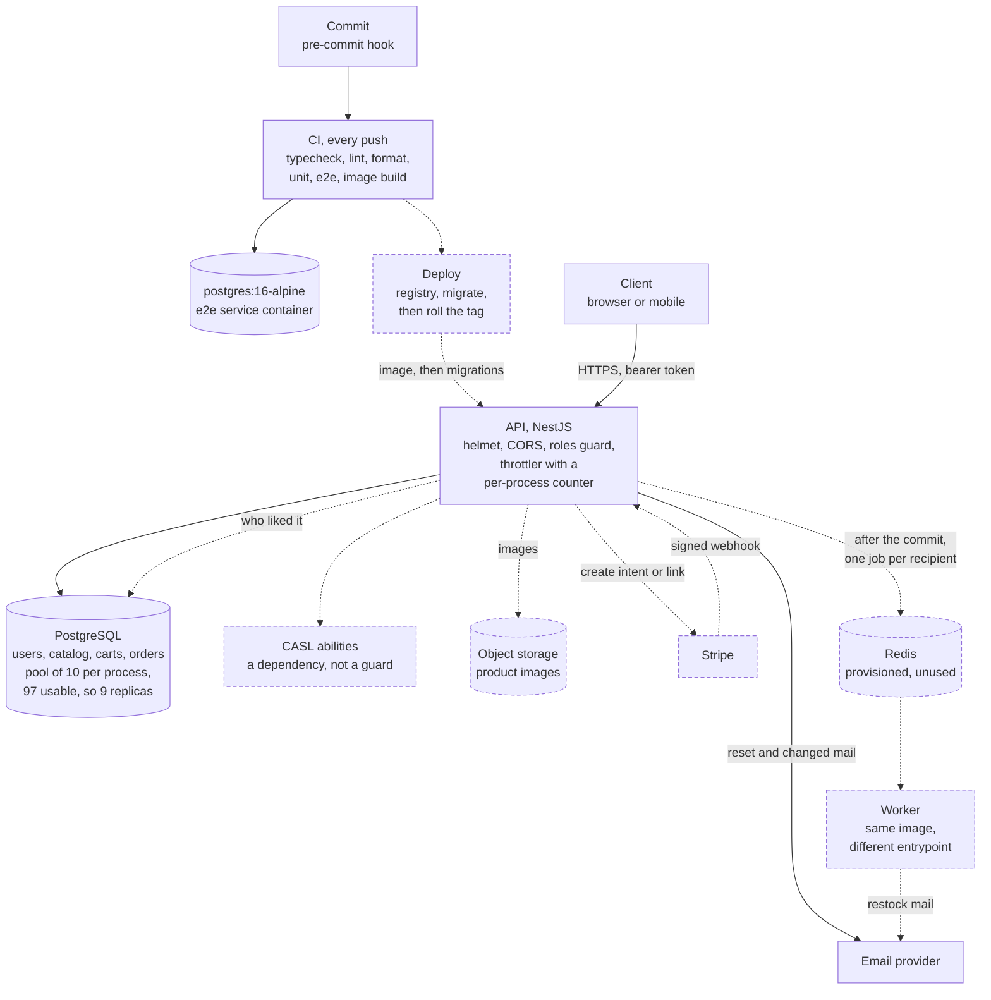

# Architecture

The T-Shirt Store API as it would run in production, and the reasoning under it. Read the diagram
first: solid is built and running, dashed is designed and not built, and an edge takes the style of
the node it touches.

## The production shape

Built is the API, Postgres, the roles guard, the password mail and the pipeline, under 129 unit and
20 end-to-end tests on a real database.

The shared ceiling is Postgres. `src/prisma/prisma.service.ts:14` builds `PrismaPg` from a
connection string and nothing else, so the pool is `pg`'s default of ten *per process* and the
ceiling is replicas times ten. My Postgres reports `max_connections=100` with three reserved for the
superuser, so nine replicas fit inside the 97 usable and a tenth does not. That ten is inherited
rather than chosen: it belongs in the environment, beside the replica count.

## What comes off the request path

When a variant's stock reaches three, every user who liked it and has not bought it gets an email:
one write, then unbounded calls to a mail provider. One producer is the Stripe webhook, which
retries any non-2xx, so a slow handler becomes duplicate deliveries. A mail outage must not fail a
paid order, so the enqueue waits for the commit. Retries have to be per recipient, because BullMQ is
at-least-once and a job dying mid-list resends everything before it: the API resolves who liked the
variant and enqueues one job each. A job that fails backs off to a fixed attempt limit, then sits in the
failed set, because a provider that rejects an address will reject it again. That set's size is the
alert.

**What I am giving up.** A crash between the commit and the enqueue loses the job, and the fix I did
not build is a transactional outbox: the intent is written inside the transaction and swept after.

## How it deploys

A container image, a managed Postgres, a managed Redis, an object store. Not serverless: a pool per
invocation multiplies connections by concurrency until the database refuses them.

**Commit to deployed.** A push runs the typecheck, the linter, the formatter, both suites and a
`docker build`, with the end-to-end suite against a throwaway Postgres service container. That runs
today. What does not: tagging the image, pushing it to a registry, running `prisma migrate deploy`
before any container takes traffic, then rolling the API and worker onto that tag. It is absent
because there is no environment to deploy to, not because it was overlooked.

**Rollback is the image, never the schema.** Redeploying the previous tag is safe only if the old
image runs against the new schema, so migrations are forward-only and additive. Three of the four
are. The exception is the second, `20260828063219_reset_token_hash_and_indexes`, which drops
`users.reset_token` in the same statement that adds `reset_token_hash`, so a replica still on the
previous image breaks mid-rollout. That rename needed expand and contract.

## Where a request fails halfway

Money and stock could disagree at the payment webhook, because Stripe holds half the state. The
tables are there and the handler is not: `20260828140754_orders_and_cart` creates `orders`,
`order_items`, `cart_items` and `order_status_history`, and no file in `src` reads or writes any of
them yet. The webhook is the only writer of `paid`: checkout creates a `pending` order and decrements
nothing, and stock comes down inside the transaction that sets `paid`, so a disagreement is one
transaction failing rather than two systems drifting. The
Stripe event id is a unique column inserted first in that transaction, so a retry becomes a unique
violation the handler answers 200 to. And reserved is not sold: the decrement is conditional on
`stock >= quantity`, and an order matching nothing is cancelled.

## Where the security risks are

**Broken access control, OWASP A01, is first.** The roles guard used to be mounted on two of six
controllers and to return true for any handler with no `@Roles`, so a forgotten decorator opened a
route silently. It is now global and denies by default, and `roles.e2e-spec.ts` pins the guard order
by asserting an anonymous call answers 401 rather than 403. What remains is that authorization is
one hand-written guard: CASL, which the challenge requires, is a dependency at `package.json:35`
that no file in `src` imports.

**Identification and authentication failures, OWASP A07, is second, with two narrow holes.**
`argon2.hash` is called with no options
(`src/users/users.service.ts:72`), so the cost is inherited: argon2 0.45.1 produces
`$argon2id$v=19$m=65536,p=4,t=3` here, above the floor today and a number nothing here checks. And
reuse detection sees only the immediately preceding token, because `previous_token_hash` is one
column every rotation overwrites, so a replay from two rotations back revokes nothing.

**Unrestricted resource consumption, OWASP API4, is third, and the deploy shape breaks it.** The
limits are right, three tiers keyed by route: 100 a minute for browsing, 10 for sign-in, 5 per 15
minutes for the password operations. The storage is not. The throttler has no adapter, so the
counter lives in one process's memory and every tier multiplies by the replica count. The fix is the
Redis storage adapter, which is why Redis sits in the compose file already. Webhook replay belongs in
this list and is not in it, because the webhook is unwritten.

## How I know it still works, and what I would watch

Per route: request rate, 4xx against 5xx, p95 latency, and saturation as pool usage and event loop
lag. Then what no infrastructure metric shows: checkout conversion, webhook lag, queue depth, and
stock going negative, which should page. Logs would carry one correlation id from the request into
the job, and never a token. Neither exists today: the only loggers in `src` sit in `ProblemFilter`
and the mailer, nothing stamps an id, and the job it would follow is unwritten.

**One regression would reach production unnoticed today.** Break the catalog's visibility rule,
either inside `visibleProductWhere` or by handing it the wrong viewer from the controller, and every
disabled product becomes visible to every customer. Nothing turns red. The 21 product unit tests
assert the `where` object handed to a **mocked** Prisma client, so they check that the service
composed a filter, not that a disabled row stays hidden from a real request against a real database.
No end-to-end test puts a disabled product in the table. The test that would catch it is short:
create a product, disable it, read the list anonymously and expect it absent, then read it as a
manager and expect it present. That is the largest gap left, and the shape of every bug a mock
cannot see.
