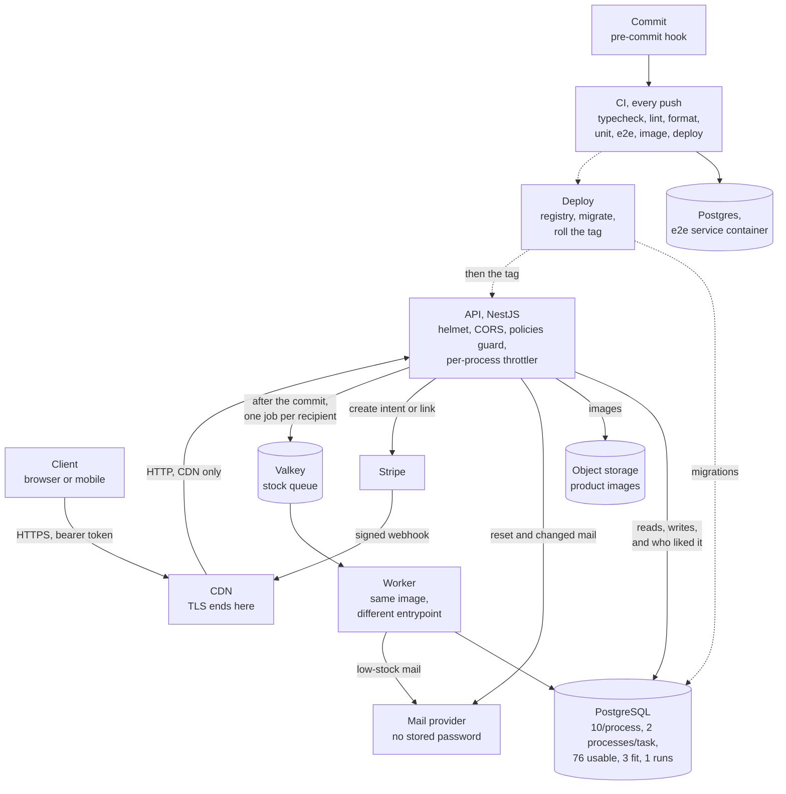

# Architecture

Everything drawn is running.

The shared ceiling is Postgres. ADR 35 records what would move it.

## What comes off the request path

One thing is queued: when a variant's stock reaches three, everyone who liked it and has not
bought it gets an email: one write, then unbounded calls to a mail provider. The enqueue waits
for the commit, so a mail outage cannot fail a paid order, and retries are per recipient,
because BullMQ is at-least-once and a job dying mid-list resends everything before it. Three
attempts, a second and two apart, then the failed set keeps the id, so that pair is never told
again.

Why BullMQ. Valkey is already provisioned for the throttler's counter once shared, and one job
type does not use what a broker sells. I rejected RabbitMQ: exchanges, bindings and
dead-lettering are routing this system has no second consumer for, and its at-least-once
guarantee is the same, so the idempotency work is identical.

**Switch:** when a second consumer needs the same event under a different routing rule,
RabbitMQ. BullMQ makes each new consumer an edit to the producer; one exchange and two
bindings makes it a deployment.

**Gives up:** a crash between the commit and the enqueue loses the job. The fix I did not
build: a transactional outbox.

## How it deploys

One CloudFormation stack in `infra/`: the image on one arm64 ECS instance behind CloudFront
for HTTPS, managed Postgres and Valkey, and an object store. Not serverless: a pool per
invocation multiplies connections by concurrency until the database refuses them. The release,
registry then `prisma migrate deploy` as a one-off task then the tag rolled, is a job per push
to `main`, assuming a role through GitHub's OIDC token, storing no key.

**Switch:** a pooler in front of Postgres removes that objection.

Migrations are additive, two aside, and run before the roll, so the old image reads the new
schema. The `reset_token` rename dropped a column the previous image still read; the `citext`
change rewrites `users` under an ACCESS EXCLUSIVE lock. Rollback is the image, rehearsed at
three minutes each way. The roll is not zero downtime: one task, one host port, seconds of 504.

## Where a request fails halfway

The seam is the payment webhook, because Stripe holds half the state. It is the only writer
of `paid`, and stock comes down inside the transaction that sets it, so a disagreement is one
failed transaction, not two drifting systems. The Stripe event id is the primary key of
`stripe_events`, inserted first in that transaction, so a retry is a unique violation. ADR 24
records the rest.

## How I know it still works, and what I would watch

Per route: request rate, 4xx against 5xx, p95 latency, and saturation as pool usage and event
loop lag. Then what infrastructure metrics miss: checkout conversion, webhook lag, the failed
set's size, and stock going negative, which pages. None of these exists yet. The logs are pino
JSON on stdout, ADR 21.

ADR 19 records where the security risks are, and the one setting no test catches.
