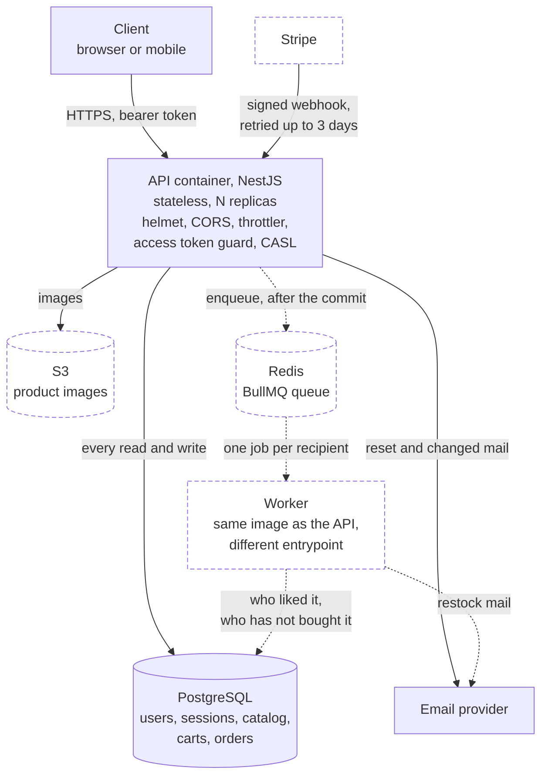

# Architecture

One page on how this service is put together, why the queue is a queue, how it would
deploy, and what I would watch. The implementation decisions sit in `DECISIONS.md`; this is
the shape above them.

## The production shape

**Solid means built and running today. Dashed means designed and not yet built:** Stripe, the
queue, the worker and S3 image storage. Authentication and the catalog are behind the solid
edges, with 129 unit tests and 17 end-to-end tests against a real database.

Three things the picture is trying to say, and they are the reason it is drawn this way.

**Stripe points inward.** The payment is confirmed between the client and Stripe directly, and
the server learns of it through a signed webhook it must verify against the raw request bytes.
The server does not poll and does not ask.

**The enqueue happens after the commit, never inside it.** That single edge carries the whole
queue argument below: a Redis outage delays a notification and can never roll back a paid order.
The cost of drawing it that way honestly is a crash window between the two, which the queue
section names rather than hides.

**The worker is the same image.** One build, one dependency tree, one set of migrations, started
with a different entrypoint. It is a deployment decision rather than a second service.

The API is stateless, so it scales horizontally. Everything that must survive a restart is
in Postgres, S3 or Redis. The worker runs the **same image** with a different entrypoint, so
there is one build, one dependency tree and one set of migrations.

## Why a queue, and not just doing the work in the request

The stock notification is the only feature that fans out. When a variant's stock reaches
three, every user who liked that variant and has not bought it gets an email. That is one
database write followed by an unbounded number of network calls to a mail provider.

**Two things move stock, so there are two producers.** A manager setting it by hand through
`PATCH /variants/{id}/stock`, and the Stripe webhook lowering it when a payment succeeds. The
manager path is the one that exists in code today and the one the feature is built against
first, because it can be exercised without Stripe. The webhook becomes a second call site on
the same producer rather than a second design.

Three reasons the work cannot sit in the request that caused it:

1. **One of the two producers is a Stripe webhook.** Stripe retries for up to three days on a
   non-2xx, so a slow handler turns into duplicate deliveries. The handler must record the
   event and return 200 quickly; mailing two hundred people is not quick. The manager path has
   no such deadline, and building for the stricter of the two producers costs nothing.
2. **A mail provider outage must not fail a paid order.** The enqueue happens strictly
   *after* the database transaction commits, so a Redis outage delays a notification and
   never rolls back a payment.
3. **Retries need to be per recipient.** BullMQ is at-least-once, so a job that dies at
   recipient 150 of 200 would re-send 149 emails on retry. One job per recipient with a
   deterministic job id makes a retry idempotent.

**What I am giving up.** A crash between the commit and the enqueue loses the job, and
nothing retries it. The correct fix is a transactional outbox: write the intent inside the
same transaction, enqueue after it resolves, and sweep undispatched rows on a schedule. I
scoped it and did not build it, because the catalog and orders were ahead of it. The
alternative that removes the outbox entirely is a queue that lives in Postgres, so the
enqueue joins the open transaction, at roughly a third of Redis's throughput. At this
store's volume that trade would be worth taking, and Redis was already in the compose file.

**Dedupe is the defect this feature always ships with.** Stock oscillating around the
threshold, three to four to three, mails the same person twice. Two things prevent it: a
`stock_notifications` row with a unique key on the pair, inserted before the mail so the
database is the arbiter of the race, and re-arming with hysteresis rather than at the
threshold, so the trigger resets only well above it.

**One question this design has not answered.** A unique key on `(user, variant)` means a
person is told once, ever, and never again when that variant is restocked months later. The
alternative is a notion of a restock episode, which the key would have to carry. The ERD
ledger records it as open, and it is a question for the next review rather than a guess made
here, because it chooses the table's primary key.

## The deploy shape

A container image, a managed Postgres, a managed Redis and an object store. Not Kubernetes, not
serverless.

- **Managed Postgres over self-hosted.** Backups, point-in-time recovery and failover are
  the whole product. For a store, losing an order is worse than any latency I would win.
- **Container over serverless.** Prisma holds a connection pool, and a serverless platform
  multiplies connections by concurrency until the database refuses them. A container with a
  fixed pool has a predictable ceiling.
- **The worker is a second deployment of the same image.** Separate scaling, separate
  failure domain, one artifact.
- **Object storage rather than a volume.** Images outlive any container and are served
  directly, so putting them on a disk the API owns would make the API stateful, which is the
  one property the rest of this shape depends on.
- **Migrations run as a release step**, before the new image takes traffic. Three of the four
  so far are additive, so an old replica keeps working through the rollout. The fourth is not:
  `reset_token_hash_and_indexes` drops a column, which would break a replica still running the
  previous image mid-deploy. The additive-only discipline is the one to hold to, and the
  expand-and-contract version of that rename, adding the new column, backfilling, then dropping
  the old one in a later release, is what a zero-downtime deploy would have required.

## What I would monitor

Split deliberately, because the first group tells you the service is up and only the second
tells you it is working.

**The four signals, per route:** request rate, error rate split 4xx against 5xx, p95 and p99
latency, and saturation as pool usage and event loop lag. A rising 4xx rate on `/auth` is a
credential-stuffing attempt; a rising 5xx rate is mine.

**What a store actually loses money on:**

- **Checkout conversion**, orders created against payments succeeded. A drop here is the
  first sign of a broken payment path, and no infrastructure metric shows it.
- **Webhook lag**, Stripe event timestamp against processing time, and the count of events
  that arrive but never reconcile. This is the metric that catches a webhook secret rotated
  in one place.
- **Queue depth and job failure rate.** A depth that grows without bound means the worker is
  down while the API happily keeps enqueueing.
- **Stock going negative**, which should be impossible and therefore should page.

**Logging.** Structured, one correlation id per request, carried into the job so a
notification can be traced back to the request that caused it, whether that was a manager
setting stock by hand or a payment webhook. Log authentication successes
and failures, authorization failures, validation failures and payment events. Never log a
password, a token, a session id or a card detail. The token hashing in this service means a
leaked log cannot be replayed even if that rule is broken by accident.

**What I would not add.** Distributed tracing and a metrics scraper, for one service and one
worker, cost more to run than the questions they answer here. The first thing I would add
under real traffic is tracing across the webhook and the job, because that is the one path
where a correlation id in a log line stops being enough.
