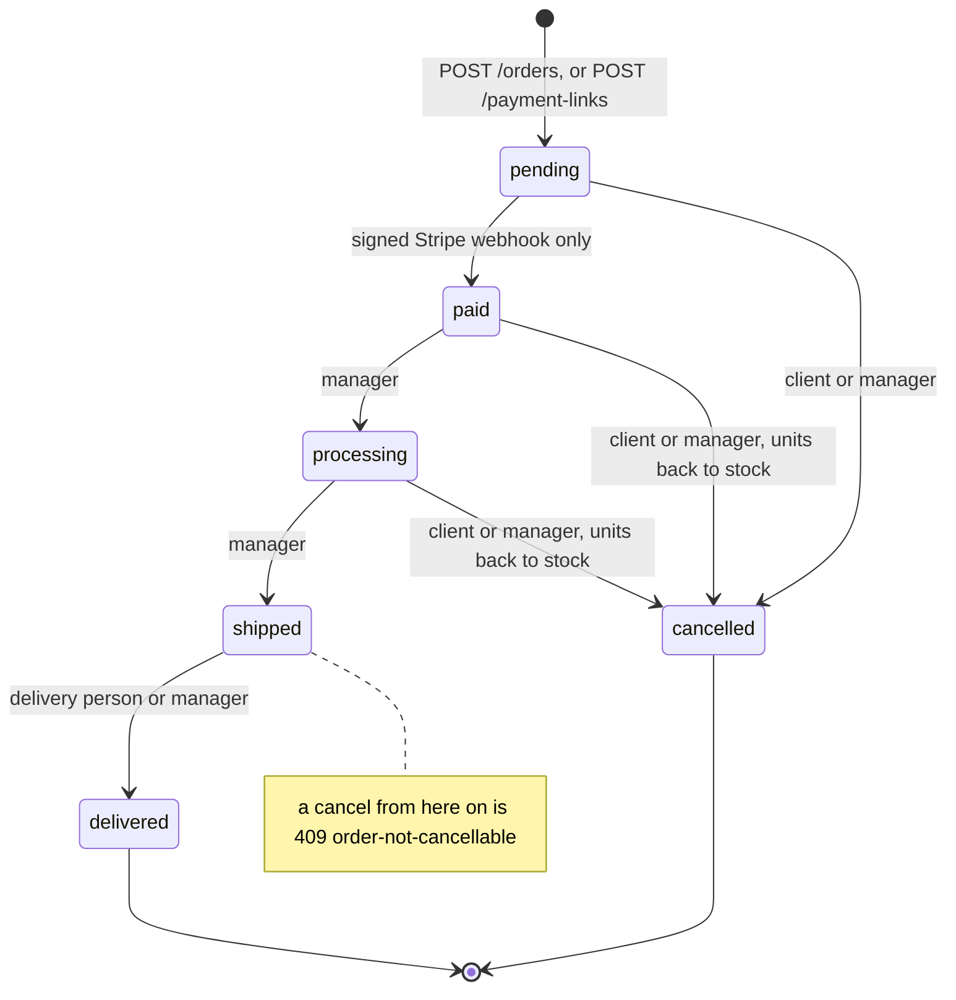
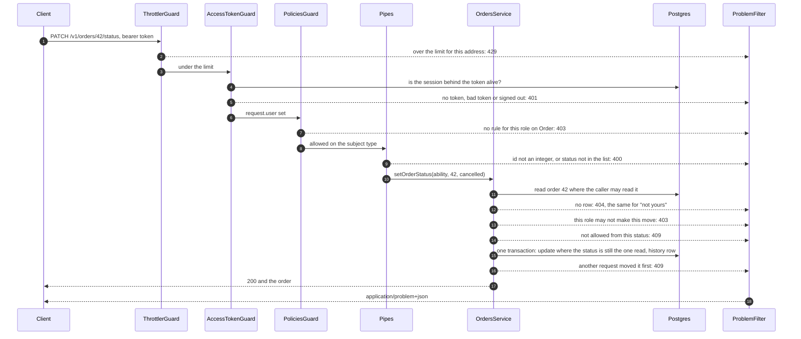
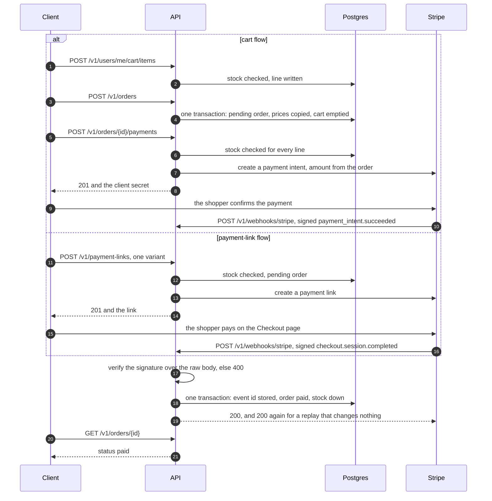

# API design

**This API has no screens. Its responses are what a client designs against.** A client decides
what to show from the status code and the problem type, and never from `title` or `detail`.
The contract is `contract/openapi.yaml`, and `test/openapi-contract.e2e-spec.ts` fails when the
served document drifts from it.

## What a client shows for each failure

Every failure is an RFC 9457 problem document (ADR 11). The problem types are the contract's
closed list, `ProblemType` in `contract/openapi.yaml`. The last column is the recommended
client behaviour.

| Status | Problem type | Means | The client shows |
|---|---|---|---|
| 400 | none | A field failed validation; `errors` names each one | The message next to each named field |
| 401 | `access-token-expired` | The access token expired | Nothing: refresh with `POST /v1/auth/refresh`, retry once |
| 401 | `refresh-token-unknown` | The refresh token is unknown or already used | The sign-in screen |
| 401 | `invalid-credentials` | Wrong email or password, or a wrong current password | "Wrong email or password", without saying which |
| 401 | none | No token, a bad token, or a signed-out session | The sign-in screen |
| 403 | none | This role may not call the operation | Nothing: hide the action for this role |
| 404 | none | The row does not exist, or belongs to someone else | "Not found", the same for both causes |
| 409 | `insufficient-stock` | Fewer units on hand than asked for | The stock now, and a lower quantity to pick |
| 409 | `order-not-cancellable` | The order has shipped | The order's status, with no cancel button |
| 409 | `email-taken` | The address already has an account | Sign in, or reset the password |
| 409 | none | Another state conflict, such as an empty cart or an order that is not `pending` | A reload of the resource |
| 413 | none | A file above 5 MiB, or a body above the parser limit | The size limit |
| 415 | none | The file is not an image | "Choose an image" |
| 422 | `promo-code-unknown` | No such code, or a manager disabled it | The field, to retype the code |
| 422 | `promo-code-expired`, `promo-code-exhausted` | The code can no longer be used | Remove the code, keep the order |
| 422 | `promo-code-minimum` | The subtotal is below the code's minimum | How much more to add |
| 422 | none | A reset token that is unknown or expired, or a category id that names nothing | A new reset mail, or the field |
| 429 | none | The rate limit, with a `Retry-After` header | Wait that many seconds |
| 500 | none | The server failed | Try again |

## The order's states

`src/orders/order-status.ts` holds the legal moves as one function. Who may make each move comes
from the CASL rules (ADR 25, ADR 36). Any other move is 409, and no request may send `paid`.

## One authenticated request

A client cancels its own order: `PATCH /v1/orders/42/status` with `{"status":"cancelled"}`. The
three guards run in registration order: `ThrottlerGuard` in `AppModule` (`src/app.module.ts:81`),
then `AccessTokenGuard` and `PoliciesGuard` in `AuthModule` (`src/auth/auth.module.ts:34-35`).
`test/roles.e2e-spec.ts` pins the second step: an anonymous caller gets 401, not 403.

Authorization happens twice: the guard checks the subject type, and the query carries the
ownership condition. That is why another client's order is 404 by construction.

## Checkout

The cart flow pays with a payment intent. The payment-link flow sells one variant outside the
cart, and the shopper pays on Stripe's hosted Checkout page. Both end at the same webhook,
which is the only writer of `paid` (ADR 24).

The cart flow needs Stripe.js and the store's publishable key, so a developer calling from a
terminal or Swagger pays through the payment link. A payment link creates its own order from
one variant. It does not pay an order already placed from the cart.

`test/checkout.e2e-spec.ts` runs both flows with Stripe's two network calls stubbed and the
signature checked for real.
